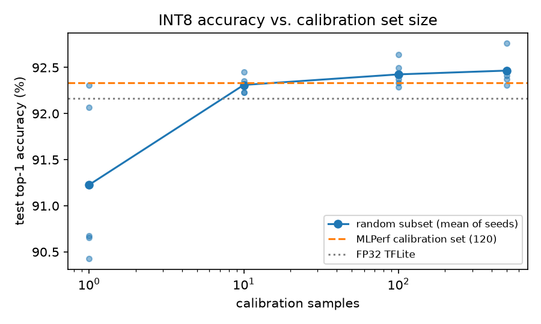
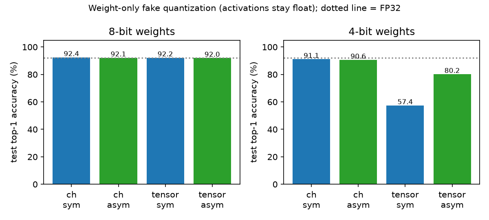

# 결과

> `scripts/report.py`가 `results/*.json`에서 자동으로 만든 문서입니다. 수치를 고치려면 JSON을 만든 스크립트를 다시 실행하세요.

## 측정 환경

- CPU: Intel(R) Xeon(R) Processor @ 2.10GHz (클라우드 x86 VM, 스레드 1개)
- Python 3.13.12, TensorFlow 2.21.0, tf-keras 2.21.0, ai-edge-litert 2.2.0, numpy 2.5.3
- 데이터: tfds `speech_commands` 0.0.3 — 테스트 4,890개, 검증 10,102개, 보정 120개(MLPerf `quant_cal_idxs.txt`)

## 1. 전처리 대조 — 이 저장소의 MFCC 구현 대 MLPerf 레퍼런스 코드

| 분할 | 샘플 수 | 특징값 비트 일치 | 레이블 일치 |
|---|---:|:---:|:---:|
| 테스트 | 4,890 | 예 | 예 |
| 검증 | 10,102 | 예 | 예 |
| 보정 | 120 | 예 | 예 |

## 2. T1 — 변환기가 정한 양자화 파라미터·값의 재현

대상: 레퍼런스 Keras 모델을 TF 2.21로 변환한 `models/kws_tf221_int8.tflite`. 재현 입력: 같은 변환의 보정 모델(`models/kws_tf221_calibrated.tflite`)에 기록된 float 가중치와 보정 min/max.

| 항목 | 결과 |
|---|---|
| 활성값 scale·zero-point | 14/14 일치 |
| 가중치 scale(채널별) | 10/10 층 일치 |
| int8 가중치 값 | 22,016개 중 불일치 0 |
| bias scale | 10/10 층 일치 |
| int32 bias 값 | 588개 중 불일치 0 (나눗셈 규칙으로 계산하면 1개 불일치) |
| 보정 min/max 직접 재측정 | TF 내장 런타임 14/14, LiteRT 12/14 비트 일치 |

MLPerf가 배포한 int8 모델과 같은 SavedModel의 변환 결과는 가중치가 거의 전부 다르다 (층마다 int8 가중치 대부분이 다르고, scale 차이가 최대 수백 %). 배포 `.tflite`와 SavedModel은 서로 다른 학습 결과로 보인다 — 자세한 근거는 docs/notes.md.

## 3. T2·T3 — numpy 정수 커널 대 LiteRT 세 실행 경로 (비트 단위)

런타임마다 원문에서 확인한 재양자화 방식을 쓴다.

| 연산 | 참조 커널(BUILTIN_REF) | 최적화 커널(XNNPACK 끔) | XNNPACK |
|---|---|---|---|
| CONV_2D | double | ruy | fp32 |
| DEPTHWISE_CONV_2D | double | neon8 | fp32 |
| FULLY_CONNECTED | float | ruy | fp32 |
| AVERAGE_POOL_2D | - | - | - |
| SOFTMAX | reference | optimized | optimized |

| 대조 | 참조 | 최적화 | XNNPACK |
|---|---:|---:|---:|
| 망 전체, mlperf_int8 (테스트 4,890개 × 출력 12) | 불일치 0 | 불일치 0 | 불일치 0 |
| 층별 13개 연산, mlperf_int8 (무작위·실제 입력 각 300개) | 불일치 0 | 불일치 0 | 불일치 0 |
| 망 전체, tf221_int8 (테스트 4,890개 × 출력 12) | 불일치 0 | 불일치 0 | 불일치 0 |
| 층별 13개 연산, tf221_int8 (무작위·실제 입력 각 300개) | 불일치 0 | 불일치 0 | 불일치 0 |
| 무작위 CONV_2D 모델 100개 (출력 전체 일치 모델 수) | 100/100 | 100/100 | 100/100 |
| 무작위 DEPTHWISE_CONV_2D 모델 100개 (출력 전체 일치 모델 수) | 100/100 | 100/100 | 100/100 |
| 무작위 FULLY_CONNECTED 모델 100개 (출력 전체 일치 모델 수) | 100/100 | 100/100 | 100/100 |
| 무작위 AVERAGE_POOL_2D 모델 100개 (출력 전체 일치 모델 수) | 100/100 | 100/100 | 100/100 |
| 무작위 SOFTMAX 모델 100개 (출력 전체 일치 모델 수) | 100/100 | 100/100 | 100/100 |

무작위 모델에서 다른 방식으로 계산하면 몇 개가 일치하는지(방식 구별력):

| 연산 · 런타임 | double | single | ruy | float | fp32 | neon8 |
|---|---:|---:|---:|---:|---:|---:|
| CONV_2D · reference | 100 | 16 | 71 | 16 | 16 | 85 |
| CONV_2D · optimized | 71 | 17 | 100 | 17 | 17 | 73 |
| CONV_2D · xnnpack | 16 | 99 | 17 | 99 | 100 | 16 |
| DEPTHWISE_CONV_2D · reference | 100 | 12 | 67 | 12 | 12 | 75 |
| DEPTHWISE_CONV_2D · optimized | 75 | 11 | 73 | 11 | 11 | 100 |
| DEPTHWISE_CONV_2D · xnnpack | 12 | 98 | 11 | 98 | 100 | 11 |
| FULLY_CONNECTED · reference | 80 | 100 | 82 | 100 | 100 | 81 |
| FULLY_CONNECTED · optimized | 88 | 82 | 100 | 82 | 82 | 95 |
| FULLY_CONNECTED · xnnpack | 80 | 100 | 82 | 100 | 100 | 81 |
| SOFTMAX · 참조/최적화/XNNPACK (참조 구현 · 최적화 구현) | 100·100 / 100·100 / 100·100 | | | | | |

## 4. FP32 대 INT8 — 정확도·크기

> **통계 읽는 법.** 같은 테스트 세트에서 두 모델을 비교할 때는 McNemar 정확 검정을 쓴다 (한쪽만 맞힌 샘플 수로 판정). 이 문서의 비교는 30개 가까이 되므로, 우연을 배제하는 기준을 **p < 0.002**(본페로니 보정, 0.05/25)로 잡는다. 그보다 큰 p값의 차이는 '구별되지 않음'으로 읽는다.

| 모델 | 테스트 정확도 | 파일 크기 | 파라미터 | MAC | x86 지연(1개, 중앙값) |
|---|---:|---:|---:|---:|---|
| FP32 Keras (레퍼런스 SavedModel) | 92.17% | - | 24,908 (BN 포함) | - | - |
| FP32 TFLite (TF 2.21 변환) | 92.17% | 99,424 B | 22,604 | 2,656,768 | optimized 0.276 ms, xnnpack 0.056 ms |
| MLPerf `*_float32.tflite` (실제로는 동적 범위 양자화) | 91.72% | 43,392 B | 22,604 | 2,656,768 | optimized 0.224 ms, xnnpack 0.074 ms |
| INT8 (TF 2.21 변환) | 92.33% | 48,480 B | 22,604 | 2,656,768 | reference 1.756 ms, optimized 0.203 ms, xnnpack 0.063 ms |
| INT8 (MLPerf 배포) | 91.80% | 53,936 B | 22,604 | 2,656,768 | reference 1.895 ms, optimized 0.213 ms, xnnpack 0.063 ms |

- INT8(TF 2.21) − FP32 Keras: +0.16%p (앞쪽만 정답 39개 · 뒤쪽만 정답 31개, p=0.403)
- 지연시간은 x86 클라우드 VM에서 잰 값이라 마이크로컨트롤러 성능을 대표하지 않는다.

런타임 사이 출력 차이(같은 int8 모델·같은 입력, 테스트 4,890개 중):

| 모델 · 입력 변환 | 참조↔최적화: 출력이 하나라도 다른 샘플 | 참조↔XNNPACK: 출력이 다른 샘플 | 참조↔XNNPACK: top-1이 다른 샘플 |
|---|---:|---:|---:|
| mlperf_int8 · truncate(reference eval) | 22 | 1696 | 23 |
| mlperf_int8 · round+clamp | 23 | 1723 | 27 |
| tf221_int8 · truncate(reference eval) | 16 | 1860 | 29 |
| tf221_int8 · round+clamp | 14 | 1814 | 31 |

INT8 정확도 — 입력 변환 방식 × 런타임:

| 모델 | 입력 변환 | 참조 | 최적화 | XNNPACK |
|---|---|---:|---:|---:|
| mlperf_int8 | truncate(reference eval) | 91.62% | 91.62% | 91.66% |
| mlperf_int8 | round+clamp | 91.80% | 91.80% | 91.86% |
| tf221_int8 | truncate(reference eval) | 92.04% | 92.04% | 92.15% |
| tf221_int8 | round+clamp | 92.33% | 92.33% | 92.60% |

- mlperf_int8: 입력값 2,396,100개 중 int8 범위 밖 3,123개, 두 변환 방식이 다른 값 1,182,308개. round+clamp − truncate (optimized): +0.18%p (앞쪽만 정답 55개 · 뒤쪽만 정답 46개, p=0.426); xnnpack − reference (round+clamp): +0.06%p (앞쪽만 정답 15개 · 뒤쪽만 정답 12개, p=0.701)
- tf221_int8: 입력값 2,396,100개 중 int8 범위 밖 3,123개, 두 변환 방식이 다른 값 1,182,312개. round+clamp − truncate (optimized): +0.29%p (앞쪽만 정답 59개 · 뒤쪽만 정답 45개, p=0.202); xnnpack − reference (round+clamp): +0.27%p (앞쪽만 정답 19개 · 뒤쪽만 정답 6개, p=0.015)

## 5. 설계 변수 실험

### A. 가중치 채널별 대 텐서별 (실제 int8 변환)

| 방식 | 정확도 | 파일 크기 |
|---|---:|---:|
| per_channel | 92.33% | 48,480 B |
| per_tensor | 92.25% | 34,584 B |

채널별 − 텐서별: +0.08%p (앞쪽만 정답 23개 · 뒤쪽만 정답 19개, p=0.644)

채널별 모델이 13.9 KB 큰 까닭: 채널별 양자화 항목이 가중치 588 + bias 588 = 1,176개이고, flatbuffer 스키마가 scale을 float32(4 B), zero-point를 int64(8 B)로 저장해 1,176 × 12 B ≈ 14.1 KB가 더 든다(텐서별은 텐서 20개 × 12 B). zero-point는 전부 0인데도 자리를 차지한다.

INT8(채널별) − FP32 TFLite: +0.16%p (앞쪽만 정답 39개 · 뒤쪽만 정답 31개, p=0.403)

### B. 보정 샘플 수 (검증 분할에서 무작위 추출, 시드 5개)

| 샘플 수 | 평균 | 최저 | 최고 |
|---:|---:|---:|---:|
| 1 | 91.23% | 90.43% | 92.31% |
| 10 | 92.31% | 92.23% | 92.45% |
| 100 | 92.43% | 92.29% | 92.64% |
| 500 | 92.47% | 92.31% | 92.76% |
| 120 (MLPerf 보정 세트) | 92.33% | | |

### C. 가중치 대칭 대 비대칭 — 시뮬레이션

가중치만 양자화→역양자화하고 활성값은 float로 둔 결과다(실제 int8 추론이 아님). 기준 FP32 TFLite 92.17%.

| 비트 | 단위 | 대칭 | 정확도 | 가중치 SQNR 평균(최저) | 이 설정 − FP32 |
|---:|---|:---:|---:|---|---|
| 8 | 채널별 | 대칭 | 92.41% | 46.4 dB (44.4) | +0.25%p (앞쪽만 정답 16개 · 뒤쪽만 정답 4개, p=0.012) |
| 8 | 채널별 | 비대칭 | 92.15% | 47.9 dB (45.4) | -0.02%p (앞쪽만 정답 10개 · 뒤쪽만 정답 11개, p=1.000) |
| 8 | 텐서별 | 대칭 | 92.19% | 41.6 dB (38.0) | +0.02%p (앞쪽만 정답 13개 · 뒤쪽만 정답 12개, p=1.000) |
| 8 | 텐서별 | 비대칭 | 91.96% | 42.5 dB (38.8) | -0.20%p (앞쪽만 정답 10개 · 뒤쪽만 정답 20개, p=0.099) |
| 4 | 채널별 | 대칭 | 91.06% | 21.3 dB (19.2) | -1.10%p (앞쪽만 정답 100개 · 뒤쪽만 정답 154개, p<0.001) |
| 4 | 채널별 | 비대칭 | 90.57% | 23.4 dB (20.9) | -1.60%p (앞쪽만 정답 97개 · 뒤쪽만 정답 175개, p<0.001) |
| 4 | 텐서별 | 대칭 | 57.36% | 16.4 dB (12.8) | -34.81%p (앞쪽만 정답 25개 · 뒤쪽만 정답 1727개, p<0.001) |
| 4 | 텐서별 | 비대칭 | 80.16% | 17.8 dB (14.0) | -12.00%p (앞쪽만 정답 49개 · 뒤쪽만 정답 636개, p<0.001) |

대칭 − 비대칭(같은 비트·단위끼리):

- 8비트 채널별: +0.27%p (앞쪽만 정답 18개 · 뒤쪽만 정답 5개, p=0.011)
- 8비트 텐서별: +0.22%p (앞쪽만 정답 23개 · 뒤쪽만 정답 12개, p=0.090)
- 4비트 채널별: +0.49%p (앞쪽만 정답 147개 · 뒤쪽만 정답 123개, p=0.161)
- 4비트 텐서별: -22.80%p (앞쪽만 정답 78개 · 뒤쪽만 정답 1193개, p<0.001)

### D. 층별 민감도 — 4-bit, per-tensor, symmetric (시뮬레이션)

| 층 | 이 층만 양자화 | 이 층만 float로 남기고 나머지 양자화 |
|---|---:|---:|
| 0:CONV_2D | 90.12% | 67.34% |
| 1:DEPTHWISE_CONV_2D | 91.64% | 58.34% |
| 2:CONV_2D | 90.14% | 66.79% |
| 3:DEPTHWISE_CONV_2D | 91.74% | 55.69% |
| 4:CONV_2D | 90.16% | 57.83% |
| 5:DEPTHWISE_CONV_2D | 91.23% | 60.76% |
| 6:CONV_2D | 82.78% | 76.69% |
| 7:DEPTHWISE_CONV_2D | 91.43% | 60.12% |
| 8:CONV_2D | 90.90% | 62.76% |
| 11:FULLY_CONNECTED | 91.92% | 59.22% |

전 층을 양자화하면 57.36%. 혼자서 가장 크게 떨어뜨리는 층은 6:CONV_2D(82.78%)이고, 이 층만 float로 두면 76.69%까지 회복된다. 나머지 층은 혼자서는 0.25~2.04%p만 떨어뜨리지만 합쳐지면 크게 떨어진다. 이 층의 가중치 SQNR은 16.4 dB로, 가장 낮은 층(0:CONV_2D, 12.8 dB)이 아니다 — SQNR만으로는 민감한 층을 고를 수 없다.

